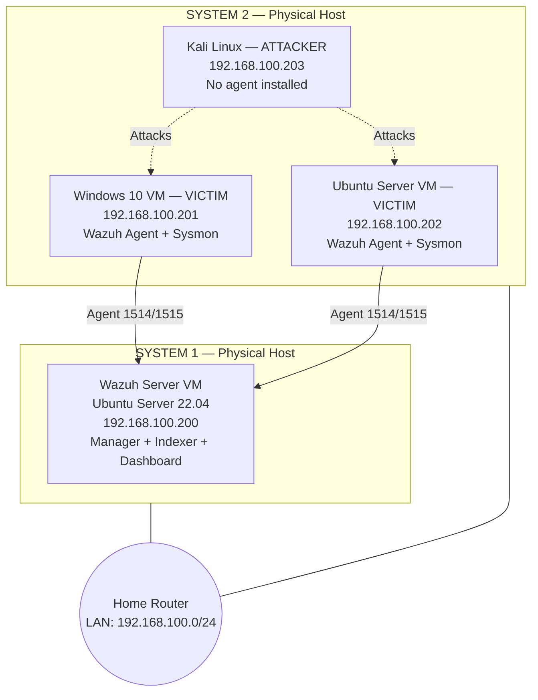

# 🛡️ Lab Architecture

## 📌 Overview

A distributed **SIEM cybersecurity homelab** built across two physical systems.

The **Wazuh Server** runs on **System 1**, while the victim machines and attacker are hosted on **System 2**.

All VMs use **bridged networking** and are connected through the local LAN, simulating a realistic enterprise monitoring environment.

---

## 🌐 Network Diagram



---

## 💻 Virtual Machines

| VM                 | OS                  | Role                               | IP Address     | Wazuh Agent            |
| ------------------ | ------------------- | ---------------------------------- | -------------- | ---------------------- |
| **Wazuh Server**   | Ubuntu Server 22.04 | SIEM — Manager, Indexer, Dashboard | `192.168.100.200` | Built-in (`agent 000`) |
| **Windows Victim** | Windows 10          | Monitored endpoint                 | `192.168.100.201` | ✅ + Sysmon             |
| **Ubuntu Victim**  | Ubuntu Server 22.04 | Monitored endpoint                 | `192.168.100.202` | ✅ + Sysmon             |
| **Attacker**       | Kali Linux          | Attack simulation                  | `192.168.100.203` | ❌ Attacker box         |

---

## 🌐 Network Design

* **Bridged networking** is configured on all VMs, giving each VM its own IP address on the LAN.
* Two physical hosts are connected through the **home router**.
* All VMs can communicate with each other across both physical systems.
* **Static IP addresses** are assigned to maintain a stable lab architecture.

---

## 🧩 Wazuh Server Components

| Component           | Function                                                               |
| ------------------- | ---------------------------------------------------------------------- |
| **Wazuh Manager**   | Receives agent events and analyzes them against detection rules        |
| **Wazuh Indexer**   | Stores and indexes alerts for searching and analysis                   |
| **Wazuh Dashboard** | Web-based interface for alert investigation and analysis (`HTTPS/443`) |

---

## 🔌 Key Ports

|    Port | Purpose                 |
| ------: | ----------------------- |
|  `1514` | Wazuh agent event data  |
|  `1515` | Wazuh agent enrollment  |
| `55000` | Wazuh API               |
|   `443` | Wazuh Dashboard — HTTPS |

---

## 🔄 Data Flow

```text
Attack (Kali)
      ↓
Victim Endpoint
      ↓
Wazuh Agent
      ↓
Wazuh Manager
      ↓
Rules Analysis
      ↓
Alert Generated
      ↓
Wazuh Indexer
      ↓
Wazuh Dashboard
      ↓
Security Analyst
```

---

## 🎯 Lab Objective

The purpose of this lab is to simulate a small **enterprise-style SOC/SIEM environment** where attacks generated from an attacker machine can be monitored through Wazuh.

The environment allows investigation of:

* Endpoint authentication activity
* Process execution
* PowerShell activity
* Windows security events
* Linux authentication events
* Suspicious commands and processes
* Attack activity generated from Kali Linux
* Wazuh detection rules and alerts
* Endpoint telemetry collected through Wazuh Agents and Sysmon
