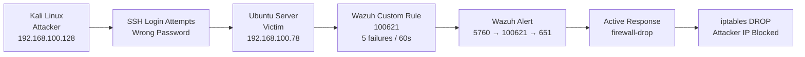
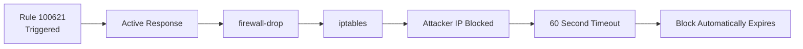
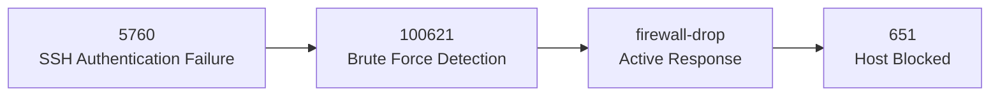

# 🔐 SSH Brute Force Detection with Custom Rule and Active Response

## 📌 Overview

Simulated an **SSH brute-force attack** from Kali Linux against an Ubuntu victim using manual SSH login attempts.

A custom Wazuh rule detects **5 failed logins from the same IP within 60 seconds**, triggering an **active response** that automatically blocks the attacker via `iptables` — with **no analyst intervention**.

### Attack → Detection → Response



---

## 🎯 MITRE ATT&CK

| Technique             | ID          | Tactic            |
| --------------------- | ----------- | ----------------- |
| **Password Guessing** | `T1110.001` | Credential Access |

---

## 🖥️ Environment

| Role         | Machine                     | IP Address        |
| ------------ | --------------------------- | ----------------- |
| **Attacker** | Kali Linux                  | `192.168.100.128` |
| **Target**   | Ubuntu Server — Agent `003` | `192.168.100.78`  |
| **Manager**  | Wazuh Server — `ubuntuuser` | `[Manager IP]`    |

---

## ⚔️ Attack Execution

The attack was performed manually from Kali Linux by repeatedly attempting to authenticate to the Ubuntu victim using an incorrect password.

```bash
ssh labuser@192.168.100.78
```

Five failed authentication attempts were generated within **60 seconds**.

The connection was then closed by the victim:

```text
Connection closed by 192.168.100.78 port 22
```

---

## 🧩 Custom Wazuh Rule — `100621`

```xml
<group name="ssh,syslog,authentication_failed,">
  <rule id="100621" level="10" frequency="5" timeframe="60">
    <if_matched_sid>5760</if_matched_sid>
    <same_srcip />
    <description>
      Multiple SSH Login failure: 5 failed logins from $(srcip) within 1 minute
    </description>
    <mitre>
      <id>T1110.001</id>
    </mitre>
    <group>authentication_failures,brute_force,</group>
  </rule>
</group>
```

### Rule Logic

| Configuration           | Purpose                                                       |
| ----------------------- | ------------------------------------------------------------- |
| `frequency="5"`         | Rule triggers after 5 matching events                         |
| `timeframe="60"`        | Events must occur within 60 seconds                           |
| `if_matched_sid="5760"` | Chains the custom rule to the SSH authentication-failure rule |
| `same_srcip`            | Requires all failures to originate from the same source IP    |
| `level="10"`            | Assigns a high-severity alert level                           |

### Detection Logic

```text
SSH Authentication Failure
          ↓
       Rule 5760
          ↓
   Same Source IP?
          ↓
   5 failures / 60s?
          ↓
     Rule 100621
          ↓
   Brute Force Detected
```

### Why a Custom Rule?

The default Wazuh rule **5763** requires **8 authentication failures within 240 seconds**.

This custom rule tightens the threshold to:

```text
5 failures / 60 seconds
```

This provides **earlier brute-force detection** while using `same_srcip` to reduce false positives from unrelated authentication failures.

---

## 🛡️ Active Response — Firewall Drop

```xml
<active-response>
  <disabled>no</disabled>
  <command>firewall-drop</command>
  <location>local</location>
  <rules_id>100621</rules_id>
  <timeout>60</timeout>
</active-response>
```

### How It Works

The active response executes on the **victim's Wazuh agent**, where the malicious traffic is being received.



The `firewall-drop` command:

* Blocks the attacker's IP using `iptables`
* Applies the response locally on the victim
* Blocks **all traffic** from the attacker IP, not only SSH
* Automatically removes the block after **60 seconds**

---

## 🔗 Alert Chain Observed

|  Rule ID | Alert Stage           | Description                                              |
| -------: | --------------------- | -------------------------------------------------------- |
|   `5760` | Attack Events         | SSH authentication failure                               |
| `100621` | **Detection**         | 5 failed logins from `192.168.100.128` within 60 seconds |
|    `651` | **Response Executed** | Host blocked by `firewall-drop`                          |

### Complete Alert Flow



---

## ✅ Verification

### Positive Test

Five manual failed SSH login attempts were generated from Kali Linux within 60 seconds.

**Result:**

* Rule `100621` triggered
* Active response executed
* Attacker IP was blocked
* `iptables` confirmed the DROP rule
* Ping from the attacker resulted in **100% packet loss**
* Rule `651` confirmed the firewall response

```text
Kali
  ↓
5 Failed SSH Attempts
  ↓
Rule 100621
  ↓
firewall-drop
  ↓
iptables DROP
  ↓
100% Packet Loss
```


## 📸 Evidence

| Evidence                             | Screenshot                                                                |
| ------------------------------------ | ------------------------------------------------------------------------- |
| Failed SSH attempts from Kali        | [Failed attempts](https://github.com/0xwasif/Wazuh-Lab/blob/main/02-attack-simulation/01-ssh-brute-force/screenshots/01-SSH-failed-attempts.png) |
| Ping — 100% packet loss              | [Ping blocked](https://github.com/0xwasif/Wazuh-Lab/blob/main/02-attack-simulation/01-ssh-brute-force/screenshots/02-ping-blocked.png)       |
| `iptables` DROP rule on victim       | [iptables block](https://github.com/0xwasif/Wazuh-Lab/blob/main/02-attack-simulation/01-ssh-brute-force/screenshots/03-iptable%20table.png)   |
| Alert chain `5760 → 100621 → 651`    | [Alert chain](https://github.com/0xwasif/Wazuh-Lab/blob/main/02-attack-simulation/01-ssh-brute-force/screenshots/04-Wazuh%20rule-chain.png)         |

---

## 🧠 Lessons Learned

### 1. Detection Threshold Matters

Changing the detection threshold from the default:

```text
8 failures / 240 seconds
```

to:

```text
5 failures / 60 seconds
```

allows the SOC to detect brute-force activity earlier.

However, tighter thresholds can increase the possibility of false positives.

---

### 2. Source IP Correlation Reduces False Positives

Using:

```xml
<same_srcip />
```

ensures that the authentication failures originate from the **same source IP**.

The negative test demonstrated that failures distributed across multiple machines do not trigger the brute-force rule.

---

### 3. Active Response Can Block More Than SSH

The `firewall-drop` response operates at the **IP level**.

Therefore, the response blocks the attacker IP from communicating with the victim rather than restricting the block specifically to SSH.

The ping test confirmed this behavior.

---

### 4. Response Events Are Auditable

Rule `651` provided confirmation that the firewall response was executed.

This creates an observable chain:

```text
Attack
  ↓
Detection
  ↓
Response
  ↓
Response Confirmation
```

This makes the automated response easier for an analyst to investigate and verify.

---

## 🏁 Conclusion

This lab demonstrated an end-to-end **SSH brute-force detection and automated response workflow using Wazuh**.

The implementation combined:

* Manual attack simulation
* SSH authentication monitoring
* Custom Wazuh detection rules
* MITRE ATT&CK mapping
* Source-IP correlation
* Automated active response
* `iptables` firewall blocking
* Positive and negative validation
* Alert-chain verification

The result was an automated workflow capable of detecting and responding to SSH brute-force activity **without requiring manual analyst intervention**.
